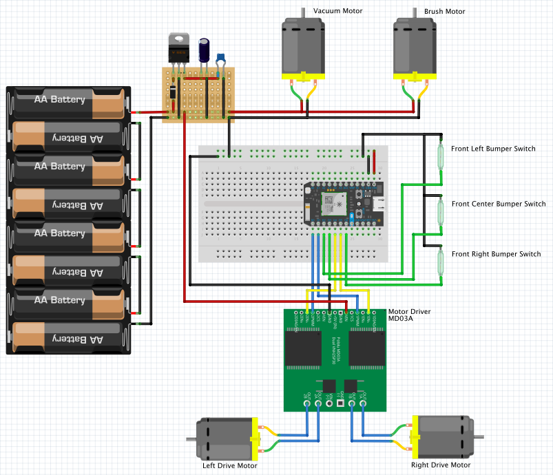

# tidyBot

I'm tired of vacuuming up after my dogs so much. They're constantly shedding, so I decided to build a robot vacuum.

## Todo
 - Rename this thing
 - Add a roller brush (currently in transit)
 - Improve straight line driving and turning with motor encoders
 - Move everything from the breadboard to a soldered proto board
 - Build an actual frame/body (planning on 1/8" plywood)
 - Full bin detector
