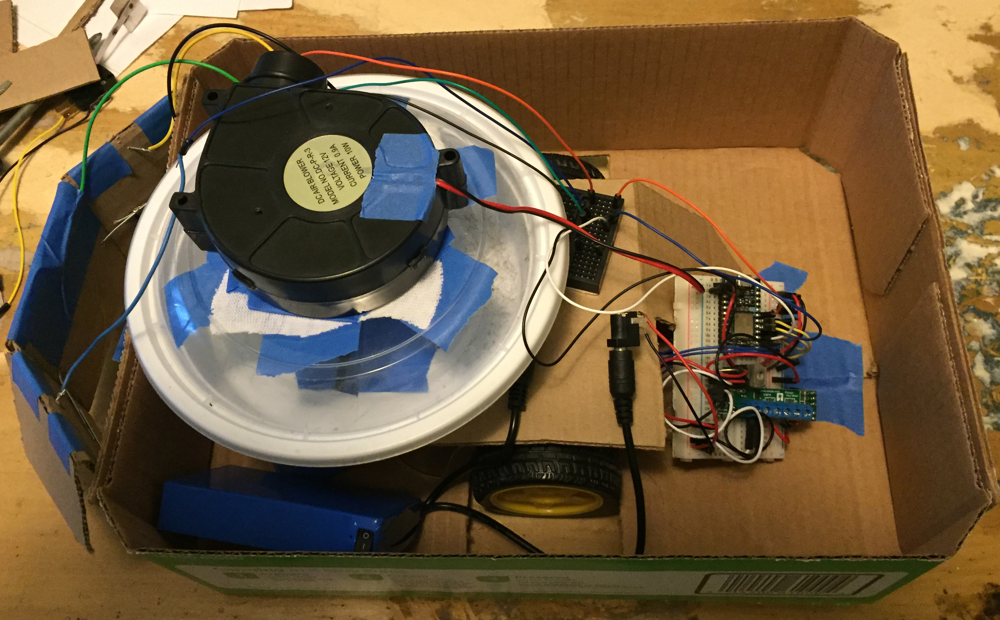
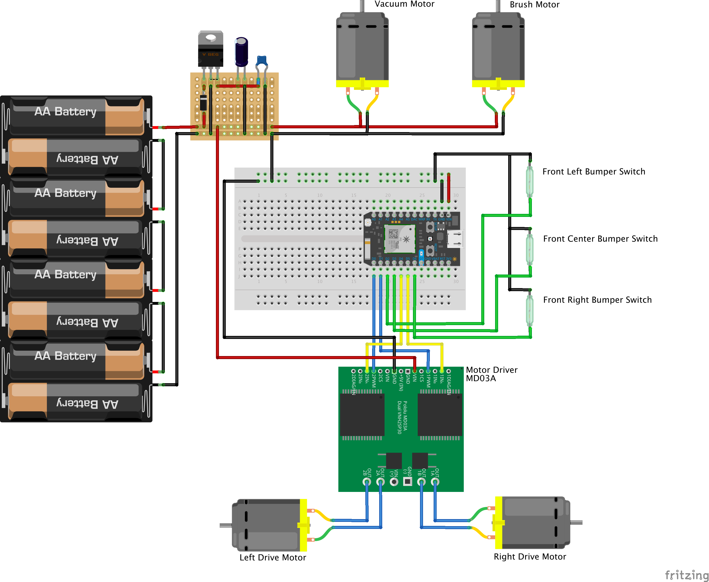
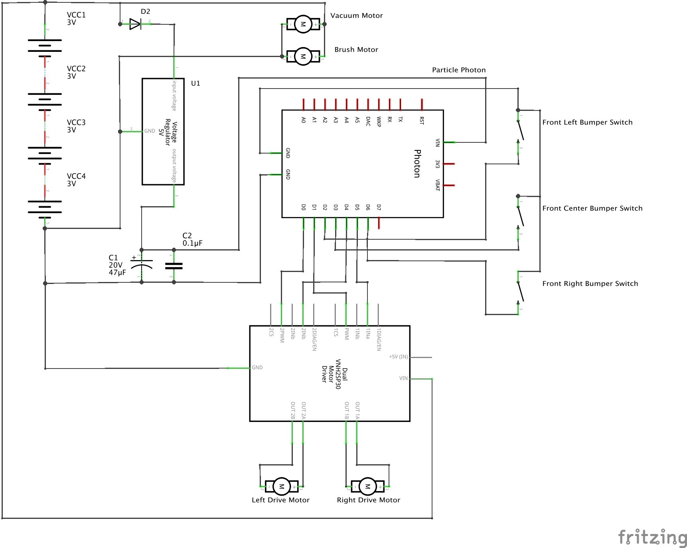

# tidyBot

I'm tired of vacuuming up after my dogs so much. They're constantly shedding, so I decided to build a robot vacuum.

This is the current state of the quick prototype I threw together.

[Video](./prototype.mov?raw=true) of a quick test of the prototype

## Parts List
 - Photon Particle (still not sure if I will use this or an Uno)
 - 12V LiPo Battery
 - L9110S Motor Controller (I can't find a Fritzing part for this, and haven't taken the time to make this yet)
 - 5V Voltage Regulator
 - 47µF Capacitor (currently using 2 22µF)
 - .1µF Capacitor
 - Diode
 - 12V Squirrel Cage Blower
 - Roomba Replacement brush roller
 - Plywood
 - 3x Contact switches

## Todo
 - Rename this thing
 - Add a roller brush (currently in transit)
 - Improve straight line driving and turning with motor encoders
 - Move everything from the breadboard to a soldered proto board
 - Build an actual frame/body (planning on 1/8" plywood)
 - Full bin detector
