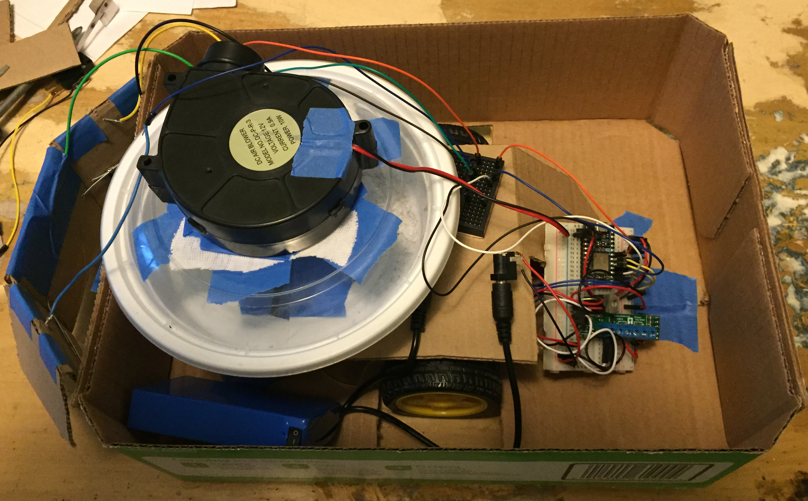
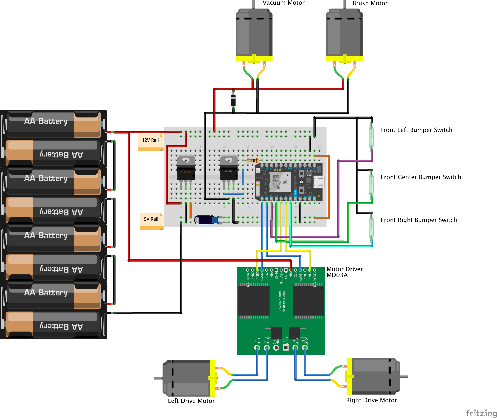
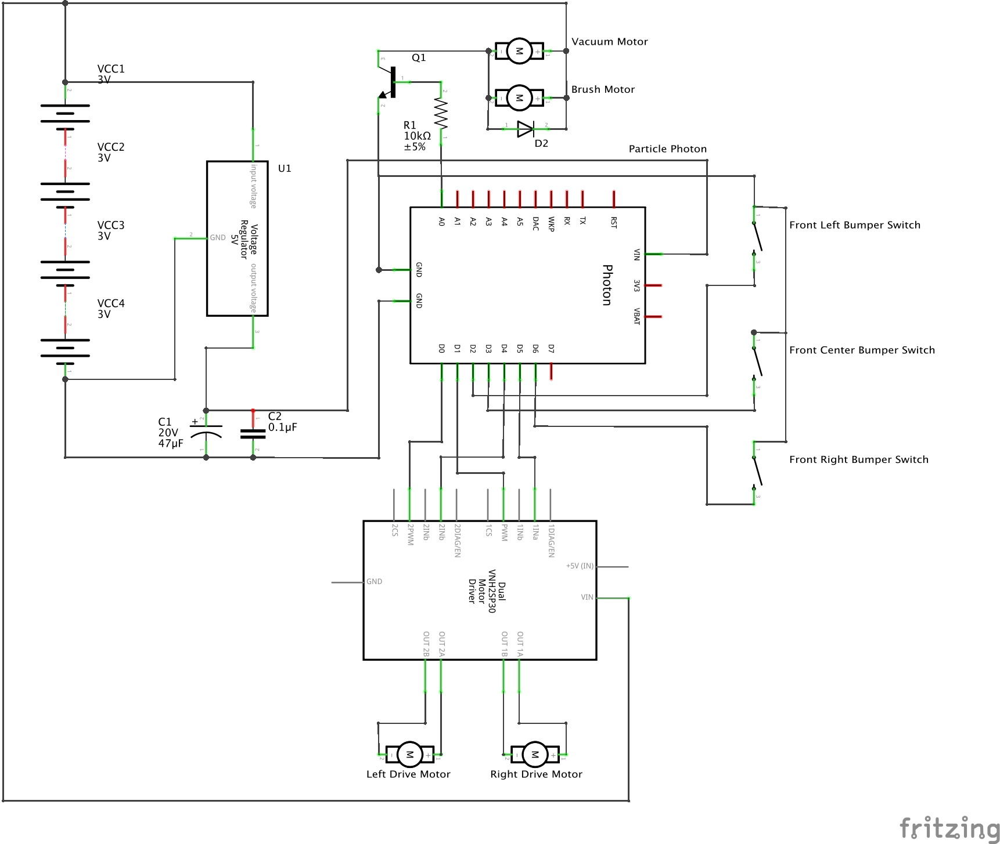

I'm tired of vacuuming up after my dogs so much. They're constantly shedding, so I decided to build a robot vacuum.

This is the current state of the quick prototype I threw together.

[Video](./readme-assets/prototype.mov?raw=true) of a quick test of the prototype cleaning my living room.

## Parts List
 - [Photon Particle](https://store.particle.io/?utm_source=homesite&utm_medium=Nav&utm_campaign=TopMenu) (still not sure if I will use this or an Uno)
 - [12V Li-ion Battery](http://www.ebay.com/sch/i.html?_odkw=Rechargeable+Li-ion+battery+for+DC+12V&_osacat=0&_from=R40&_trksid=p2045573.m570.l1313.TR0.TRC0.H0.XRechargeable+Li-ion+battery+12V.TRS0&_nkw=Rechargeable+Li-ion+battery+12V&_sacat=0)
 - [L9110S Motor Controller](http://www.ebay.com/sch/i.html?_odkw=Rechargeable+Li-ion+battery+12V&_osacat=0&_from=R40&_trksid=p2045573.m570.l1313.TR0.TRC0.H0.XL9110S.TRS0&_nkw=L9110S&_sacat=0) (I can't find a Fritzing part for this, and haven't taken the time to make this yet)
 - [5V Voltage Regulator](http://www.ebay.com/sch/i.html?_odkw=L9110S&_osacat=0&_from=R40&_trksid=p2045573.m570.l1313.TR3.TRC2.A0.H0.X5v+voltage+regulator.TRS0&_nkw=5v+voltage+regulator&_sacat=0)
 - [47µF Capacitor](http://www.ebay.com/sch/i.html?_odkw=.47+capacitor&_osacat=0&_from=R40&_trksid=p2045573.m570.l1313.TR0.TRC0.H0.Xelectrolytic+.47+capacitor+.TRS0&_nkw=electrolytic+.47+capacitor+&_sacat=0) (currently using 2 22µF)
 - [.1µF Capacitor](http://www.ebay.com/sch/i.html?_from=R40&_trksid=p2050601.m570.l1313.TR0.TRC0.H0.X.001+capacitor.TRS5&_nkw=.001+capacitor&_sacat=0)
 - [Diode](http://www.ebay.com/sch/i.html?_from=R40&_trksid=p2050601.m570.l1313.TR0.TRC0.H0.Xdiode.TRS0&_nkw=diode&_sacat=0)
 - [12V Squirrel Cage Blower](https://www.sparkfun.com/products/11270)
 - [Roomba Replacement brush roller](http://www.ebay.com/sch/i.html?_odkw=roomba+replacement&_osacat=0&_from=R40&_trksid=p2045573.m570.l1313.TR1.TRC0.A0.H0.Xroomba+replacement+brush.TRS1&_nkw=roomba+replacement+brush&_sacat=0)
 - [1/8" Hardboard](http://www.homedepot.com/p/Hardboard-Tempered-Common-1-8-in-x-2-ft-x-4-ft-Actual-0-125-in-x-23-75-in-x-47-75-in-7005015/202088786)
 - 3x Contact switches (homemade)

## Todo
 - Rename this thing
 - Add a roller brush (currently in transit)
 - Improve straight line driving and turning with motor encoders
 - Move everything from the breadboard to a soldered proto board
 - Build an actual frame/body (from the 1/8" hardboard)
 - Full bin detector (IR LED and sensor?)
